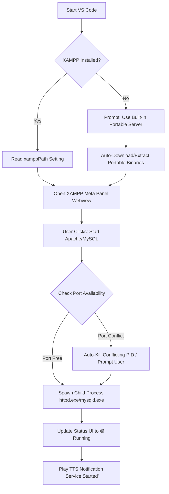
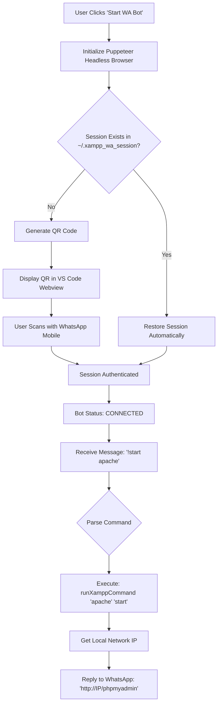
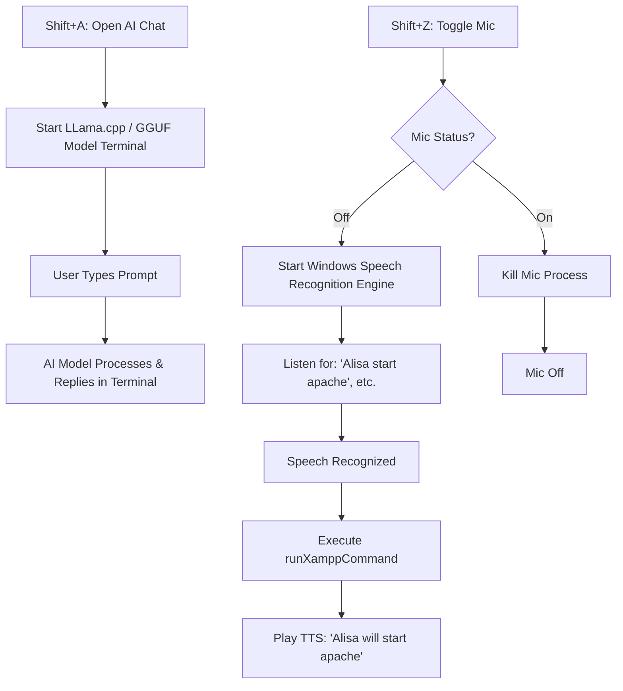
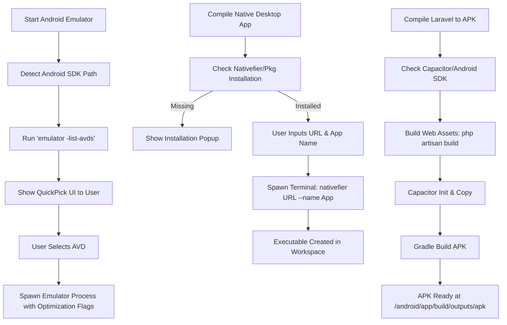
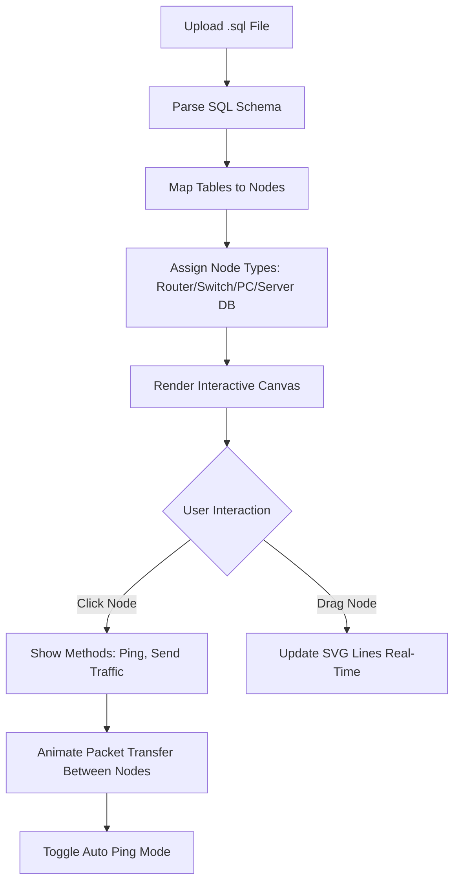

# XAMPP Meta Panel For VS Code

<p align="center">

</p>

<p align="center">
<strong>🚀 Run Apache, MySQL, and PHP directly from VS Code — No need to manually install XAMPP!</strong>
</p>

<p align="center">
<a href="https://open-vsx.org/extension/Royhtml/xampp-manager"></a>
  <a href="https://open-vsx.org/extension/Royhtml/xampp-manager">
    
  </a>

  <a href="https://github.com/royhtml">
    
  </a>

  <a href="mailto:dwibakti76@gmail.com">
    
  </a>
</p>

---


## 🎯 Why XAMPP Meta Panel?


Tired of having to open the XAMPP Control Panel repeatedly just to start a local server? Or lazy about downloading and configuring XAMPP on each different computer?

XAMPP Meta Panel provides a portable PHP/MySQL development environment directly within VS Code. This extension detects your XAMPP installation or provides an internal server runtime so you can focus on coding, not server configuration. Plus, it comes with an AI Assistant, WhatsApp Bot remote control, IoT compilation, Android Emulator management, and Native App compilation!

## ✨ Key Features Premium


### ⚡️ **Zero-Download Runtime (Outstanding Feature)**
* **No Need to Reinstall XAMPP:** This extension provides the ability to run an embedded server (PHP built-in server & portable MariaDB) if XAMPP is not detected on your system.
* **One Click, Instant Run:** Right-click on your project folder, select `XAMPP: Serve Project Here`, and your website will open instantly in your browser.

### 🌐 Official Website
*Experience complete control without leaving your code editor.*


### 🎛️ **Unified Control Center**
* An elegant control panel inside the **VS Code Sidebar** that displays the status of:
* 🟢 **Apache** (Port 80/8080)
* 🟢 **MySQL** (Port 3306)
* Quick action buttons: `Start All`, `Stop All`, `Restart`, and `Open phpMyAdmin`.

### 📂 **Smart Workspace Detection**
* Automatically reads the `htdocs` folder from your local XAMPP installation.
* **Virtual Host Creator:** Create `*.test` virtual host configurations directly from VS Code without manually fiddling with the `httpd-vhosts.conf` file.

### 🐳 **Database Manager Integration**
* Quick access to **phpMyAdmin** directly from the Status Bar.
* MySQL Shell: Run SQL queries directly from the Command Palette (Ctrl+Shift+P > XAMPP: Run SQL Query).

### 🔔 Intelligent Notifications
Get real-time notifications when the server is running successfully or encounters a port conflict error.
* Auto-kill Process: If port 80 conflicts, the extension will offer to automatically kill the process.

## 🗝️ API Key Not Limited For Free
Api Key No Limited Full For Free Api 


## 🗝️ API Key Dashboard Test Token Request
Api Key No Limited Full For Free Api Check in Website and Test Request Token


## Swap Version Tutorial Xampp Meta Panel
Change Version Php and PhpMyAdmin Easy Patch V4.9 Not Otomation


---
## 🤖 WhatsApp Bot AI & Remote Control

Control your entire local server and development environment from anywhere using WhatsApp!

<div align="center">
  <table>
    <tr>
      <td align="center" width="50%">
        
        <br/><sub><b>WhatsApp Bot Control</b></sub>
      </td>
      <td align="center" width="50%">
        
        <br/><sub><b>WhatsApp Bot Control</b></sub>
      </td>
    </tr>
    <tr>
      <td align="center" width="50%">
        
        <br/><sub><b>WhatsApp Bot Control</b></sub>
      </td>
      <td align="center" width="50%">
        
        <br/><sub><b>WhatsApp Bot Control</b></sub>
      </td>
    </tr>
  </table>
</div>
<div align="center">
  <table>
    <tr>
      <td align="center" width="50%">
        
        <br/><sub><b>WhatsApp Bot Control</b></sub>
      </td>
      <td align="center" width="50%">
        
        <br/><sub><b>WhatsApp Bot Control</b></sub>
      </td>
    </tr>
    <tr>
      <td align="center" width="50%">
        
        <br/><sub><b>WhatsApp Bot Control</b></sub>
      </td>
      <td align="center" width="50%">
        
        <br/><sub><b>WhatsApp Bot Control</b></sub>
      </td>
    </tr>
  </table>
</div>

## 📸 Interface

*Experience complete control without leaving your code editor.*


## 🛜 Topology Network

*Experience complete control without leaving your code editor.*


---

## 🔄 How It Works (Architecture & Flowcharts)

XAMPP Meta Panel integrates deeply with your system to provide a seamless development experience. Below are the core operational flowcharts.

### 1. 🚀 General System Initialization & Service Management
When you open the panel or trigger a command, the extension automatically detects your environment and executes the corresponding processes.



### 2. 🤖 WhatsApp Bot AI Control Flow
The WhatsApp integration uses `whatsapp-web.js` and Puppeteer to maintain a persistent session. You can control services remotely via chat commands.



### 3. 🧠 Local AI Chat & Voice Assistant (Alisa)
Interact with your workspace using text or voice. The voice assistant uses Windows Speech API natively.



### 4. 📱 Android Emulator & Cross-Platform Compilation
Manage Android emulators and compile web projects directly into Desktop or Mobile apps.



### 5. 🔬 Network Topology Simulator (SQL to Cisco Visualizer)
Visualize your database schema as a network architecture.



---

## ⚙️ Extension Settings

Customize the extension's behavior via VS Code Settings (`Settings.json`).

| Setting ID | Description | Default |
| :--- | :--- | :--- |
| `xampp.enableTTS` | Enable or disable Text-to-Speech (TTS) voice announcements. | `true` |
| `xampp.showSplashScreen` | Show or hide the splash screen when opening XAMPP Meta Panel. | `true` |
| `xampp.ggufPath` | Path to the local GGUF AI model file for offline AI chat. | `""` |
| `xampp.aiModels` | Catalog of saved GGUF AI model paths. | `[]` |
| `xampp.xamppPath` | Custom path to your XAMPP installation directory. | `C:\xampp` |
| `xampp.autoBackupOnStop` | Automatically backup MySQL databases when stopping the server. | `false` |
| `xampp.androidEmulatorPath` | Cached path to Android emulator executable (auto-detected). | `""` |
| `xampp.androidQuickBoot` | Enable Quick Boot for faster Android Emulator startup. | `true` |
| `xampp.androidCpuCores` | Number of CPU cores allocated to Android Emulator (1-8). | `2` |
| `xampp.androidRamSize` | RAM size for Android Emulator in MB (512-8192). | `2048` |
| `xampp.androidUseHostGpu` | Use host GPU acceleration (recommended for better performance). | `true` |
| `xampp.androidNoAudio` | Disable audio in emulator to save resources (recommended). | `true` |
| `xampp.androidNoBootAnim` | Skip boot animation for faster startup. | `false` |
| `xampp.androidNoSnapshot` | Disable snapshot feature (use for troubleshooting). | `false` |

Example configuration in `settings.json`:
```json
{
  "xampp.enableTTS": true,
  "xampp.xamppPath": "D:\\my_xampp",
  "xampp.androidCpuCores": 4,
  "xampp.androidRamSize": 4096
}
```

---

## ⌨️ Keyboard Shortcuts & Commands

Open the Command Palette (`Ctrl+Shift+P` / `Cmd+Shift+P`) and type `XAMPP`, or use the following shortcuts:

| Shortcut | Command ID | Description |
| :--- | :--- | :--- |
| `Shift + Z` | `xampp.openPanel` | Opens the XAMPP Meta Panel Webview. |
| `Shift + C` | `xampp.compileNativeApp` | Compile current project to Desktop App (Nativefier). |
| `Shift + X` | `xampp.pioCreateProject` | Create new PlatformIO/Wokwi IoT Project. |
| `Shift + T` | `xampp.openCliTerminal` | Open the dedicated XAMPP CLI Terminal. |
| `Shift + Alt` | `xampp.pioCompile` | Compile PlatformIO Firmware. |
| `Shift + Q` | `xampp.switchVersions` | Switch XAMPP PHP Version. |
| `Shift + H` | `xampp.compileLaravelApk` | Compile Laravel project to Android APK. |
| `Shift + A` | `xampp.openAiChat` | Start AI Chat with GGUF Model. |
| `Shift + E` | `xampp.startEmulator` | Start Android Emulator. |

---

## 📦 Full WhatsApp Bot Command Reference

| Command | Description |
| :--- | :--- |
| `!start apache` | Start Apache server remotely |
| `!stop apache` | Stop Apache server remotely |
| `!start mariadb` | Start MariaDB service remotely |
| `!stop mariadb` | Stop MariaDB service remotely |
| `!start laravel <folder>` | Start Laravel dev server on port 8000 |
| `!stop laravel` | Kill Laravel server process |
| `!start python <folder>` | Start python dev server |
| `!stop python` | Kill python server process |
| `!start php <folder>` | Start PHP built-in server on port 8081 |
| `!stop php` | Kill PHP built-in server process |
| `!start flutter <folder>` | Start Flutter web server on port 8080 |
| `!stop flutter` | Kill Flutter web process |
| `!build flutter` | Build Apk Flutter |
| `!build app` | Build Android |
| `!build ios` | Build IOS |
| `!system` | System check |
| `!preview` | Preview monitor |
| `!stop preview` | Stop Preview monitor |
| `!ai on` | Ai Ready |
| `!ai off` | Ai Stop |
| `!ai <question>` | Ready And Questions |
| `!htdocs` | htdocs files |
| `!preview` | Preview monitor |
| `!start ngrok <port>` | ngrok running port |
| `!stop ngrok <port>` | ngrok stop running port |
| `!cleanup` | Force kill all XAMPP processes |
| `!query <SQL>` | Execute global SQL query |
| `!db <name> <SQL>` | Execute SQL on specific database |
| `!setvercel <key>` | Save Vercel API deployment key |
| `!deploy <project>` | Deploy project to Vercel (attach file) |
| `!web2exe <url><appname>` | Compile file exe |
| `!status` | Show full bot command list |

---

## 🆕 What's New in Version 5.0.0

### 🤖 **WhatsApp Bot Control Center**
* **Persistent Session:** Scan the QR code once, and the bot will remember your session permanently.
* **Remote Server Management:** Start/Stop Apache, MariaDB, Laravel, Flutter, and PHP directly via WhatsApp.
* **Database Queries via Chat:** Execute SQL queries directly from WhatsApp (`!query`, `!db`).
* **Vercel Cloud Deployment:** Deploy projects directly to Vercel from WhatsApp.

### 🧠 **Local AI Chat Integration (GGUF)**
* **Privacy First:** Run AI models locally directly inside VS Code.
* **Add/Delete Models:** Easily manage your downloaded GGUF models via the Command Palette.

### 🎙️ **Alisa Voice Assistant**
* **Hands-Free Coding:** Toggle the global mic to issue voice commands (e.g., "Alisa start apache").
* **Windows Speech API:** Natively integrated for ultra-low latency voice recognition.

### 📱 **Android Emulator & Cross-Platform Compilation**
* **Emulator Management:** Start/Stop Android AVDs directly from the panel with optimization settings.
* **Native Desktop Apps:** Compile any web project to a standalone Desktop app (Windows/Mac/Linux).
* **Laravel to APK:** Turn your Laravel project into an Android APK using Capacitor.

### 🔬 **Network Topology Simulator (SQL to Cisco Visualizer)**
* **Drag & Drop SQL Import:** Upload your `.sql` files to automatically parse table schemas and visualize them as interactive network nodes.
* **Live Packet Animation:** Simulate network communication between nodes.

### 🌐 **Expanded System Tools**
* **WSL Terminal Launcher:** Quick access to Windows Subsystem for Linux.
* **Netstat Network Scanner:** Detect all active listening ports on your system.
* **Enhanced Mobile Access Fixer:** One-click solution to fix "403 Forbidden" errors on phpMyAdmin.

---

## 🐛 Known Issues

* **Windows Defender:** When you first start the extension, Windows SmartScreen may flag the portable binaries. Allow the process in your security settings.
* **WhatsApp Session Reset:** If the Puppeteer browser cache becomes corrupted, you may need to re-scan the QR code. The session files are stored in `%USERPROFILE%\.xampp_wa_session`.
* **Port Conflicts:** If ports 80, 443, 3306, or 8000 are already in use, the services will fail to start. Use the Netstat Scanner to identify conflicting processes.
* **TTS Limitation:** Text-to-Speech and Voice Recognition currently rely on Windows PowerShell and .NET System.Speech, meaning they are Windows-only features.

---

## 🛠️ Installation

Install this extension directly from the **Open VSX Registry**:

👉 [**Install XAMPP Meta Panel on Open VSX**](https://open-vsx.org/extension/Royhtml/xampp-manager)

Or search for `XAMPP Meta Panel` in the VS Code Extensions marketplace.

---

## 👨‍💻 Developer

**Dwi Bakti N Dev / Roy** - Creator & Maintainer of XAMPP Meta Panel.

* [GitHub](https://github.com/royhtml)
* [Email](mailto:Dwibakti76@gmail.com)
